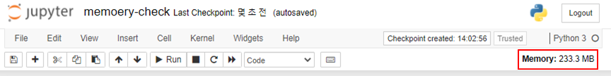

# jupyter notebook Ram usage Check
- 참고 링크 : https://github.com/jupyter-server/jupyter-resource-usage
---
##### Installation
```
conda install -c conda-forge jupyter-resource-usage

jupyter serverextension enable --py jupyter-resource-usage --sys-prefix
jupyter nbextension install --py jupyter-resource-usage --sys-prefix
jupyter nbextension enable --py jupyter-resource-usage --sys-prefix
```

```
jupyter notebook --ResourceUseDisplay.track_cpu_percent=True
```


__아래와 같이 jupyter notebok에 RAM 사용량을 수시로 확인할 수 있음__


